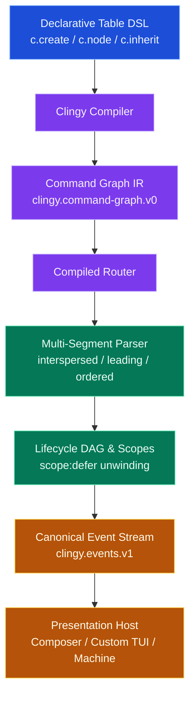

# Clingy

Clingy is a deterministic, declarative CLI engine for Lua. It combines pure table DSL composition, precomputed command graph routing, multi-segment grammar modes, structured resource scopes, subprocess supervision, and a decoupled Presentation Host boundary.

The package is a portable Lua executable and library artifact: one Clingy release supports Lua 5.1–5.5 and LuaJIT 2.1. Moonstone locks its exact artifact and runtime profile in each consuming project.

---

## 1. Quick Start

### Install

Add Clingy to your Moonstone project:

```sh
moon add moonstone/clingy
moon exec clingy -- init --config ./.luarc.json --yes
```

### Define a Command Tree

```lua
local c = require("clingy")
local v = require("valua")

local app = c.create({
  name = "deployer",
  version = "1.0.0",
  description = "Production Deployment Utility",

  c.root(c.node({
    c.inherit(
      c.flag("-v", "--verbose"),
      c.flag("--json")
    ),

    deploy = c.node({
      c.arg("environment", v.picklist({ "development", "staging", "production" })),
      c.option("-t", "--tag", v.string(), { default = "latest" }),
      c.flag("-d", "--dry-run"),

      c.run(function(ctx)
        ctx:log("info", string.format("Deploying %s to %s (dry-run: %s)",
          ctx.args.tag, ctx.args.environment, tostring(ctx.args.dry_run)))
        return { status = "deployed", env = ctx.args.environment }
      end),
    }, {
      description = "Deploy application to target environment",
    }),
  })),
})

app:run(arg)
```

---

## 2. Architecture & Runtime Lifecycle

Clingy compiles declarative command definitions into an immutable Command Graph IR, parses tokens with multi-segment grammar policies, and dispatches execution through a structured lifecycle DAG.



---

## 3. Core Capabilities

### Declarative Table Grammar
- `c.node({ ... }, metadata?)`: Declarative node tree with nested child subcommands.
- `c.inherit(...)`: Explicit downward inheritance of options, flags, and grammar rules.
- `c.arg(name, schema)`: Positional arguments with cardinality algebra.
- `c.option(short, long, schema)`: Named value options.
- `c.flag(short, long)`: Boolean toggle flags.
- `c.optional(decl)`, `c.required(decl)`, `c.repeated(decl)`: Cardinality modifiers.

### Multi-Segment Parser Modes
- `c.interspersed()`: Options and positionals may appear in any order within segment (default).
- `c.leading()`: Options must strictly precede positionals in the segment.
- `c.ordered()`: Declarations must strictly match declared argument order.
- `c.short_clusters()`: Expands clustered short flags (`-xvf` $\to$ `-x -v -f`).
- `c.passthrough()`: Captures raw unparsed tokens following `--`.

### Standard Schema Validation
Adapts string tokens to native types and validates via Standard Schema v1 (`https://standardschema.dev`) across Valua and custom validator libraries.

### Presentation Host Boundary
- **`Composer`**: Polished default Host supporting `auto`, `fancy`, `plain` (zero ANSI), `quiet`, and `ndjson` machine stream.
- **Custom Hosts**: Pluggable interface (`start`, `handle_event`, `suspend`, `resume`, `prompt`, `finish`, `close`) for full-screen TUIs, web dashboards, and test recorders.

---

## 4. LuaLS Type Autocompletion

Clingy includes full LuaCATS definitions in `luals/library/clingy.lua` providing type completions for `Context`, `App`, `PresentationHost`, and schema-inferred arguments in `ctx.args`.
