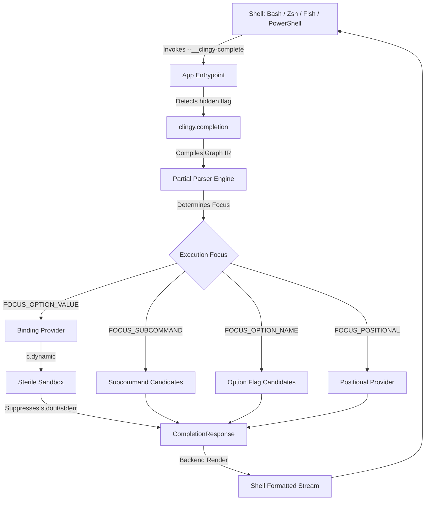

# Clingy Shell Completion Architecture

## 1. Abstract & Scope

This document specifies the architectural model, declaration algebra, provider ecosystem, and runtime execution of the **Clingy Shell Completion Subsystem**.

Shell completion in Clingy is designed with four fundamental principles:
1. **Zero-Overhead Declarative Syntax**: Completions can be declared statically via `c.complete(provider, decl)` or inferred automatically from standard schema validations (e.g. picklists/enums).
2. **Deterministic Partial Parsing**: Rather than relying on fragile regex heuristics or shell-side parsing, Clingy executes a specialized `PartialParser` on the compiled Command Graph IR to accurately determine the execution focus (subcommand, option name, option value, or positional argument).
3. **Sterile Execution Sandbox**: Dynamic completion callbacks execute within a sandboxed runtime environment where accidental standard output, standard error, or unhandled Lua errors are silently caught, preventing shell session corruption or hung terminals.
4. **Universal Multi-Shell Support**: Native bridges generate fast completion scripts and protocol responses for Bash, Zsh, Fish, and PowerShell without external dependencies.

---

## 2. Architectural Overview



When a user triggers shell completion (typically with `<TAB>`), the shell invokes the binary with the hidden silent endpoint:
```bash
$ myapp --__clingy-complete --shell=zsh --index=2 -- myapp run d
```

1. `App:run()` intercepts the hidden `--__clingy-complete` endpoint before any user code, output composer, or process supervisors are initialized.
2. The partial parser analyzes the token vector up to `--index`, navigating the Command Graph IR.
3. The focused element is resolved to either:
   - Available subcommands at the current node.
   - Available option flags (both local and inherited).
   - Value candidates for an option flag.
   - Value candidates for a positional argument.
4. Providers execute to generate candidate items. Dynamic callbacks execute inside `sandbox_execute`, receiving a `CompletionContext` populated with parsed predecessor arguments.
5. A `CompletionResponse` is constructed, filtered by the current partial word prefix, and passed to the shell backend to render shell-native completions.

---

## 3. Declaration Algebra

Completion providers are attached to arguments and options using the `c.complete(provider, decl)` combinator:

```lua
local c = require("clingy")

-- 1. Static list of string values
c.complete(c.values({ "development", "staging", "production" }),
  c.option("-e", "--environment")
)

-- 2. Structured candidates with descriptions
c.complete(c.values({
  { value = "json", description = "NDJSON formatted stream" },
  { value = "yaml", description = "Structured YAML output" },
  { value = "text", description = "Plain human-readable output" },
}), c.option("-f", "--format"))

-- 3. Filesystem paths
c.complete(c.file("*.lua"), c.option("-s", "--script"))
c.complete(c.directory(), c.option("-d", "--dest-dir"))
c.complete(c.path(), c.arg("input_path"))

-- 4. Dynamic contextual completions
c.complete(c.dynamic(function(ctx)
  local env = ctx.args.environment or "development"
  if env == "production" then
    return { "prod-db-1", "prod-db-2" }
  else
    return { "local-db", "test-db" }
  end
end), c.arg("database"))

-- 5. Explicit suppression of completion
c.complete(c.none(), c.option("-p", "--password"))
```

### Provider Constructors

| Constructor | Description | Default Directives |
|---|---|---|
| `c.values(items)` | Static array of strings or candidate tables `{ value, description? }` | `DEFAULT` (0) |
| `c.path(pattern?)` | Instructs the shell to complete filesystem paths | `FILENAMES` (1) |
| `c.file(pattern?)` | Instructs the shell to complete regular files | `FILENAMES` (1) |
| `c.directory()` | Instructs the shell to complete directory names | `DIRECTORIES` (2) |
| `c.dynamic(fn)` | Computes candidates dynamically at invocation time | Defined by returned `CompletionResponse` |
| `c.none()` | Explicitly suppresses file fallback and completions | `NO_FILES` (4) |

---

## 4. Schema-Derived Options Discovery

When no explicit `c.complete(...)` provider is declared on an option or positional argument, Clingy queries the schema adapter via `adapter.inspect_schema(schema)`:

```mermaid
flowchart TD
    Decl[Binding Declaration] --> HasExplicit{Has c.complete?}
    HasExplicit -->|Yes| UseExplicit[Use Explicit Provider]
    HasExplicit -->|No| HasSchema{Has Schema?}
    HasSchema -->|No| UseDefault[Default Shell Completion]
    HasSchema -->|Yes| Inspect[Inspect Schema via Adapter]
    Inspect --> IsEnum{Is Enum / Picklist?}
    IsEnum -->|Yes| AutoValues[Auto-derive c.values(items)]
    IsEnum -->|No| UseDefault
```

### Strict Precedence Hierarchy
1. **Explicit `c.complete` / `c.none`**: Highest priority. If an author explicitly specifies `c.complete(...)`, schema discovery is bypassed.
2. **Schema-Derived Options**: Second priority. If a Valua schema or custom schema adapter declares a picklist/enum (e.g. `v.picklist({ "read", "write" })`), Clingy automatically extracts these options as completion candidates.
3. **Implicit Default**: If neither is present, default completion behavior (or shell file completion) is used according to the binding kind.

---

## 5. The Partial Parser Engine

The partial parser (`clingy.completion.partial_parser`) implements a state machine over the compiled Command Graph IR:

```lua
local parser = require("clingy.completion.partial_parser")
local focus = parser.parse(graph, words, current_index)
```

### Focus Types
- `FOCUS_SUBCOMMAND`: The cursor is positioned on a token that resolves to a subcommand.
- `FOCUS_OPTION_NAME`: The cursor begins with `-` or `--` and is requesting available flags.
- `FOCUS_OPTION_VALUE`: The cursor is completing the value argument for a previously recognized option (or an inline `--option=val`).
- `FOCUS_POSITIONAL`: The cursor is completing a positional argument for the active command node.
- `FOCUS_PASSTHROUGH`: The cursor is positioned after `--`; all Clingy options and subcommands are suppressed.

### State Transitions & Boundaries
- **Segment Transitions**: When a token matches a child node, the parser pushes a new segment to the active route, updates local option visibility, and preserves inherited ancestor options.
- **Inline Option Values**: Tokens matching `--opt=val` are split into option name and partial value, focusing `FOCUS_OPTION_VALUE` directly on `val`.
- **Short-Cluster Preservation**: Clusters like `-xvf` are parsed; if the final flag accepts an argument, completion shifts focus to the argument.

---

## 6. Dynamic Context & Sterile Execution Sandbox

Dynamic completion functions receive a `CompletionContext`:
```lua
---@class CompletionContext
---@field args table<string, any> @ Parsed predecessor arguments (dual-access)
---@field words string[] @ Raw argv tokens up to cursor
---@field current_word string @ Token currently under the cursor
---@field index integer @ 1-based index of current token
---@field command_path string[] @ Dotted route to the current command node
```

### Sterile Sandbox Guarantees
Dynamic callbacks execute inside `sandbox_execute(fn, ctx)`:
1. **Output Suppression**: `print`, `io.write`, and standard stream operations are intercepted and redirected to a scratch buffer. Output is discarded to prevent corrupting shell completion streams.
2. **Error Suppression**: If a dynamic callback raises a Lua error, `pcall` intercepts the error, returns an empty `CompletionResponse`, and allows the shell session to continue unimpeded.
3. **Dual-Access Args**: `ctx.args` supports both camelCase, snake_case, and kebab-case keys (e.g. `ctx.args.log_level` and `ctx.args["log-level"]`).

---

## 7. Directive Bitmasks

Directives are 32-bit bitmasks controlling shell behavior:

```lua
CompletionResponse.DIRECTIVE_DEFAULT     = 0  -- Standard candidates only
CompletionResponse.DIRECTIVE_FILENAMES   = 1  -- Fallback to shell filename completion
CompletionResponse.DIRECTIVE_DIRECTORIES = 2  -- Fallback to shell directory completion
CompletionResponse.DIRECTIVE_NO_FILES    = 4  -- Inhibit shell default file completion
CompletionResponse.DIRECTIVE_NO_SPACE    = 8  -- Inhibit trailing space after completion
```

These directives are rendered by shell backends to instruct Bash (`compopt`), Zsh (`compadd`), Fish, or PowerShell on exact cursor and suggestion behaviors.
